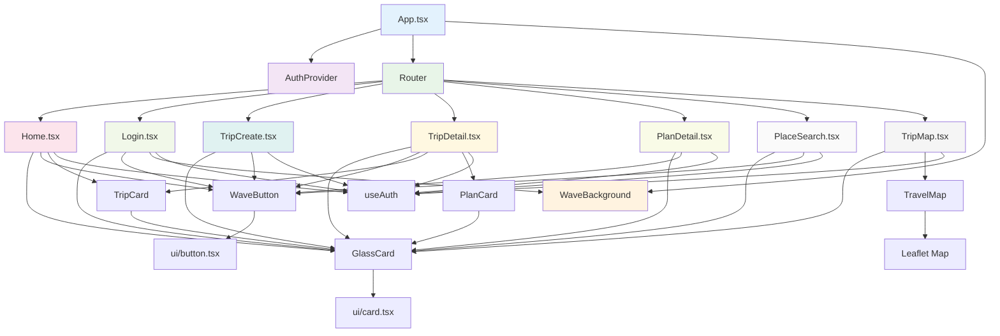
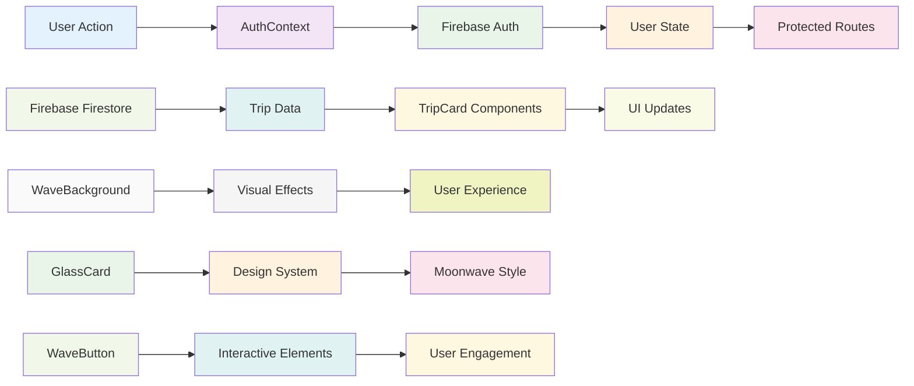
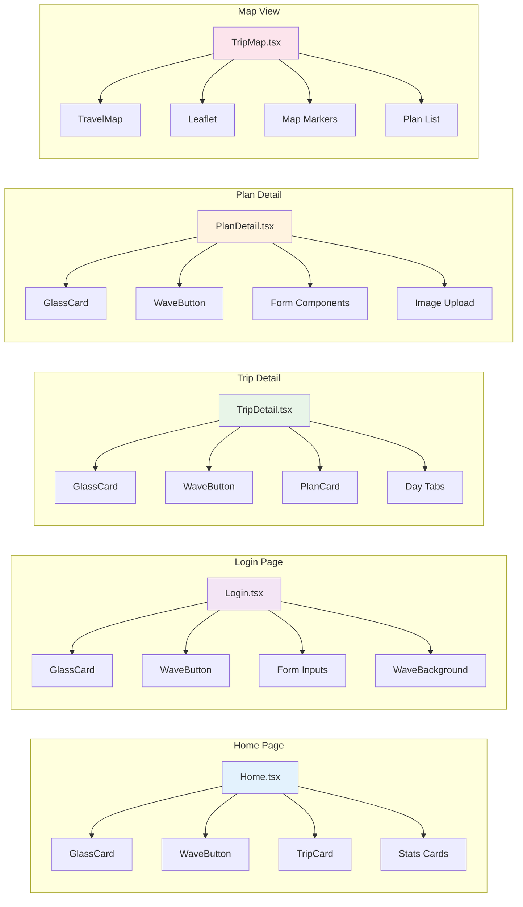
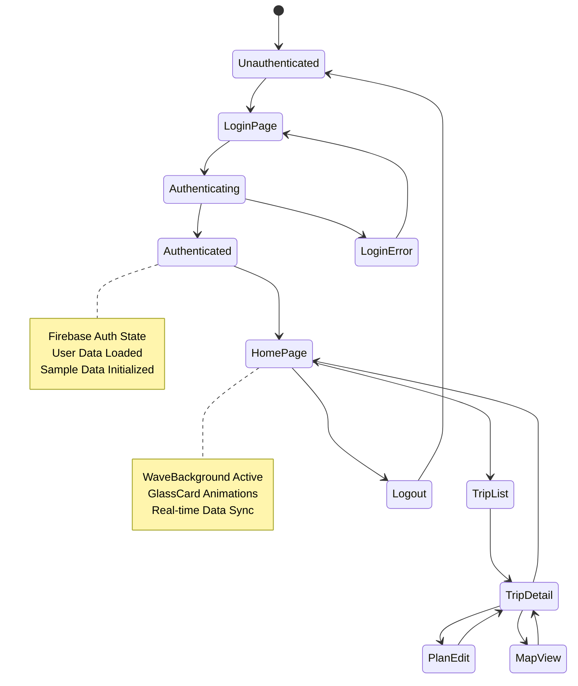
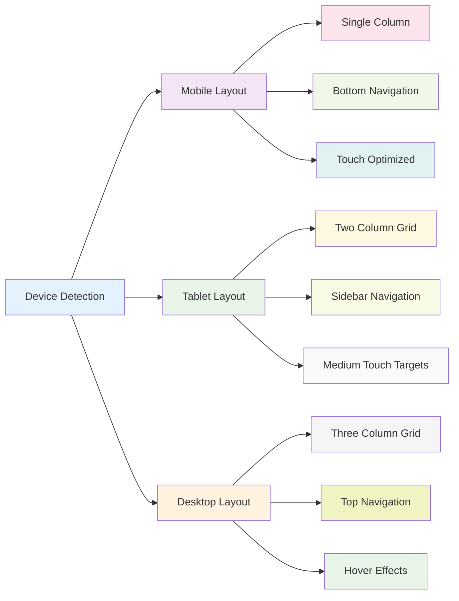

```mermaid
graph TD
    A[Moonwave Design System] --> B[WaveBackground]
    A --> C[GlassCard]
    A --> D[WaveButton]
    A --> E[Typography]
    A --> F[Color Palette]
    A --> G[Animations]
    
    B --> H[Canvas Animation]
    B --> I[Wave Effects]
    
    C --> J[Backdrop Blur]
    C --> K[Border Effects]
    C --> L[Shadow System]
    
    D --> M[Ripple Effects]
    D --> N[Hover States]
    D --> O[Loading States]
    
    E --> P[Font Weights]
    E --> Q[Line Heights]
    E --> R[Letter Spacing]
    
    F --> S[Primary Colors]
    F --> T[Secondary Colors]
    F --> U[Gradient System]
    
    G --> V[Fade In]
    G --> W[Slide Up]
    G --> X[Bounce Gentle]
    G --> Y[Wave Pulse]
    
    style A fill:#e3f2fd
    style B fill:#f3e5f5
    style C fill:#e8f5e8
    style D fill:#fff3e0
    style E fill:#fce4ec
    style F fill:#f1f8e9
    style G fill:#e0f2f1
```

```mermaid
graph TD
    A[React 19] --> B[TypeScript]
    A --> C[Vite]
    A --> D[Tailwind CSS]
    
    B --> E[Type Safety]
    B --> F[IntelliSense]
    
    C --> G[Fast Development]
    C --> H[HMR]
    C --> I[Optimized Build]
    
    D --> J[Utility Classes]
    D --> K[Custom Theme]
    D --> L[Responsive Design]
    
    M[Firebase] --> N[Authentication]
    M --> O[Firestore]
    M --> P[Storage]
    
    Q[Radix UI] --> R[Accessibility]
    Q --> S[Unstyled Components]
    Q --> T[Design System]
    
    U[Leaflet] --> V[Map Display]
    U --> W[Markers]
    U --> X[Interactions]
    
    style A fill:#e3f2fd
    style B fill:#f3e5f5
    style C fill:#e8f5e8
    style D fill:#fff3e0
    style E fill:#fce4ec
    style F fill:#f1f8e9
    style G fill:#e0f2f1
    style H fill:#fff8e1
    style I fill:#f9fbe7
    style J fill:#fafafa
    style K fill:#f5f5f5
    style L fill:#f0f4c3
    style M fill:#e8f5e8
    style N fill:#fff3e0
    style O fill:#fce4ec
    style P fill:#f1f8e9
    style Q fill:#e0f2f1
    style R fill:#fff8e1
    style S fill:#f9fbe7
    style T fill:#fafafa
    style U fill:#f5f5f5
    style V fill:#f0f4c3
    style W fill:#e8f5e8
    style X fill:#fff3e0
```

# Moonwave Travel - 컴포넌트 관계도

## 🔗 컴포넌트 의존성 다이어그램

## 📊 데이터 플로우 다이어그램

## 🎯 페이지별 컴포넌트 사용 현황

## 🔄 상태 관리 플로우

## 🎨 디자인 시스템 계층

## 📱 반응형 구조

## 🔧 기술 스택 통합

이 다이어그램들은 Moonwave Travel 앱의 복잡한 컴포넌트 관계와 데이터 플로우를 시각적으로 표현하여 개발자들이 전체 아키텍처를 쉽게 이해할 수 있도록 도와줍니다.
