# Moonwave Travel - src 폴더 구조

## 📁 전체 구조 다이어그램

```mermaid
graph TD
    A[src/] --> B[App.tsx]
    A --> C[index.css]
    A --> D[main.tsx]
    A --> E[setupTests.ts]
    A --> F[env.d.ts]
    A --> G[vite-env.d.ts]
    A --> H[App.css]
    
    A --> I[pages/]
    A --> J[components/]
    A --> K[utils/]
    A --> L[lib/]
    A --> M[contexts/]
    A --> N[types/]
    A --> O[assets/]
    
    I --> I1[Home.tsx]
    I --> I2[Login.tsx]
    I --> I3[TripCreate.tsx]
    I --> I4[TripDetail.tsx]
    I --> I5[PlanDetail.tsx]
    I --> I6[PlaceSearch.tsx]
    I --> I7[TripMap.tsx]
    
    J --> J1[GlassCard.tsx]
    J --> J2[WaveButton.tsx]
    J --> J3[TripCard.tsx]
    J --> J4[PlanCard.tsx]
    J --> J5[WaveBackground.tsx]
    J --> J6[TravelMap.tsx]
    
    J --> J7[ui/]
    J7 --> J7A[accordion.tsx]
    J7 --> J7B[alert-dialog.tsx]
    J7 --> J7C[alert.tsx]
    J7 --> J7D[aspect-ratio.tsx]
    J7 --> J7E[avatar.tsx]
    J7 --> J7F[badge.tsx]
    J7 --> J7G[breadcrumb.tsx]
    J7 --> J7H[button-variants.ts]
    J7 --> J7I[button.tsx]
    J7 --> J7J[calendar.tsx]
    J7 --> J7K[card.tsx]
    J7 --> J7L[carousel.tsx]
    J7 --> J7M[chart-hooks.ts]
    J7 --> J7N[chart-themes.ts]
    J7 --> J7O[chart-utils.ts]
    J7 --> J7P[chart.tsx]
    J7 --> J7Q[checkbox.tsx]
    J7 --> J7R[collapsible.tsx]
    J7 --> J7S[command.tsx]
    J7 --> J7T[context-menu.tsx]
    J7 --> J7U[dialog.tsx]
    J7 --> J7V[drawer.tsx]
    J7 --> J7W[dropdown-menu.tsx]
    J7 --> J7X[form.tsx]
    J7 --> J7Y[hover-card.tsx]
    J7 --> J7Z[input-otp.tsx]
    J7 --> J7AA[input.tsx]
    J7 --> J7AB[label.tsx]
    J7 --> J7AC[menubar.tsx]
    J7 --> J7AD[navigation-menu.tsx]
    J7 --> J7AE[pagination.tsx]
    J7 --> J7AF[popover.tsx]
    J7 --> J7AG[progress.tsx]
    J7 --> J7AH[radio-group.tsx]
    J7 --> J7AI[resizable.tsx]
    J7 --> J7AJ[scroll-area.tsx]
    J7 --> J7AK[select.tsx]
    J7 --> J7AL[separator.tsx]
    J7 --> J7AM[sheet.tsx]
    J7 --> J7AN[sidebar.tsx]
    J7 --> J7AO[skeleton.tsx]
    J7 --> J7AP[slider.tsx]
    J7 --> J7AQ[sonner.tsx]
    J7 --> J7AR[switch.tsx]
    J7 --> J7AS[table.tsx]
    J7 --> J7AT[tabs.tsx]
    J7 --> J7AU[textarea.tsx]
    J7 --> J7AV[toggle-group.tsx]
    J7 --> J7AW[toggle-variants.ts]
    J7 --> J7AX[toggle.tsx]
    J7 --> J7AY[tooltip.tsx]
    J7 --> J7AZ[typography.tsx]
    J7 --> J7BA[use-mobile.ts]
    J7 --> J7BB[utils.ts]
    
    J --> J8[__tests__/]
    J8 --> J8A[GlassCard.test.tsx]
    J8 --> J8B[TripCard.test.tsx]
    J8 --> J8C[WaveButton.test.tsx]
    J8 --> J8D[__snapshots__/]
    J8D --> J8D1[GlassCard.test.tsx.snap]
    J8D --> J8D2[TripCard.test.tsx.snap]
    J8D --> J8D3[WaveButton.test.tsx.snap]
    
    K --> K1[analytics.ts]
    K --> K2[copyDataForUser.ts]
    K --> K3[generateSampleData.ts]
    K --> K4[performance.ts]
    
    L --> L1[firebase.ts]
    L --> L2[utils.ts]
    
    M --> M1[AuthContext.tsx]
    M --> M2[index.ts]
    
    N --> N1[app.ts]
    N --> N2[auth.ts]
    N --> N3[index.ts]
    N --> N4[place.ts]
    N --> N5[plan.ts]
    N --> N6[trip.ts]
    
    O --> O1[react.svg]
    
    style A fill:#e1f5fe
    style I fill:#f3e5f5
    style J fill:#e8f5e8
    style K fill:#fff3e0
    style L fill:#fce4ec
    style M fill:#f1f8e9
    style N fill:#e0f2f1
    style O fill:#fff8e1
```

## 📋 폴더별 상세 설명

### 🎯 **pages/** - 페이지 컴포넌트
여행 앱의 주요 페이지들을 포함합니다.

- **Home.tsx** - 메인 홈 페이지 (여행 목록)
- **Login.tsx** - 로그인 페이지
- **TripCreate.tsx** - 새 여행 생성 페이지
- **TripDetail.tsx** - 여행 상세 페이지
- **PlanDetail.tsx** - 일정 편집 페이지
- **PlaceSearch.tsx** - 장소 검색 페이지
- **TripMap.tsx** - 지도 보기 페이지

### 🧩 **components/** - 재사용 가능한 컴포넌트

#### 핵심 컴포넌트
- **GlassCard.tsx** - 글래스모피즘 카드 컴포넌트
- **WaveButton.tsx** - 웨이브 애니메이션 버튼
- **TripCard.tsx** - 여행 카드 컴포넌트
- **PlanCard.tsx** - 일정 카드 컴포넌트
- **WaveBackground.tsx** - 웨이브 배경 애니메이션
- **TravelMap.tsx** - 지도 컴포넌트

#### UI 컴포넌트 (ui/)
Radix UI 기반의 재사용 가능한 UI 컴포넌트들:
- **button.tsx** - 버튼 컴포넌트
- **card.tsx** - 카드 컴포넌트
- **dialog.tsx** - 다이얼로그 컴포넌트
- **input.tsx** - 입력 필드 컴포넌트
- **form.tsx** - 폼 컴포넌트
- **progress.tsx** - 진행률 컴포넌트
- **badge.tsx** - 배지 컴포넌트
- **avatar.tsx** - 아바타 컴포넌트
- **calendar.tsx** - 캘린더 컴포넌트
- **chart.tsx** - 차트 컴포넌트
- **carousel.tsx** - 캐러셀 컴포넌트
- **dropdown-menu.tsx** - 드롭다운 메뉴
- **navigation-menu.tsx** - 네비게이션 메뉴
- **tabs.tsx** - 탭 컴포넌트
- **tooltip.tsx** - 툴팁 컴포넌트
- **typography.tsx** - 타이포그래피 컴포넌트
- **utils.ts** - UI 유틸리티 함수들

#### 테스트 파일 (__tests__/)
- **GlassCard.test.tsx** - 글래스 카드 테스트
- **TripCard.test.tsx** - 여행 카드 테스트
- **WaveButton.test.tsx** - 웨이브 버튼 테스트
- **__snapshots__/** - 테스트 스냅샷 파일들

### 🔧 **utils/** - 유틸리티 함수들
- **analytics.ts** - 분석 관련 유틸리티
- **copyDataForUser.ts** - 사용자 데이터 복사 유틸리티
- **generateSampleData.ts** - 샘플 데이터 생성 유틸리티
- **performance.ts** - 성능 관련 유틸리티

### 📚 **lib/** - 라이브러리 설정
- **firebase.ts** - Firebase 설정 및 초기화
- **utils.ts** - 공통 유틸리티 함수들

### 🔄 **contexts/** - React Context
- **AuthContext.tsx** - 인증 상태 관리 컨텍스트
- **index.ts** - 컨텍스트 내보내기

### 📝 **types/** - TypeScript 타입 정의
- **app.ts** - 앱 전체 타입 정의
- **auth.ts** - 인증 관련 타입 정의
- **index.ts** - 타입 내보내기
- **place.ts** - 장소 관련 타입 정의
- **plan.ts** - 일정 관련 타입 정의
- **trip.ts** - 여행 관련 타입 정의

### 🎨 **assets/** - 정적 자산
- **react.svg** - React 로고 SVG

### 📄 **루트 파일들**
- **App.tsx** - 메인 앱 컴포넌트
- **main.tsx** - 앱 진입점
- **index.css** - 글로벌 스타일
- **App.css** - 앱 스타일
- **setupTests.ts** - 테스트 설정
- **env.d.ts** - 환경 변수 타입 정의
- **vite-env.d.ts** - Vite 환경 타입 정의

## 🏗️ 아키텍처 특징

### 📦 **모듈화된 구조**
- 각 기능별로 명확히 분리된 폴더 구조
- 재사용 가능한 컴포넌트들의 체계적 관리
- 타입 안전성을 위한 TypeScript 타입 정의

### 🎨 **디자인 시스템**
- Moonwave 스타일의 일관된 디자인
- 글래스모피즘과 웨이브 애니메이션
- Radix UI 기반의 접근성 고려

### 🧪 **테스트 구조**
- 컴포넌트별 단위 테스트
- 스냅샷 테스트 지원
- 테스트 파일들의 체계적 관리

### 🔥 **Firebase 통합**
- 실시간 데이터베이스 연동
- 인증 시스템 통합
- 파일 저장소 연동

### 📱 **PWA 지원**
- Progressive Web App 기능
- 오프라인 지원
- 앱 설치 가능

이 구조는 확장성과 유지보수성을 고려하여 설계되었으며, Moonwave 여행 앱의 모든 기능을 체계적으로 관리할 수 있도록 구성되어 있습니다.
